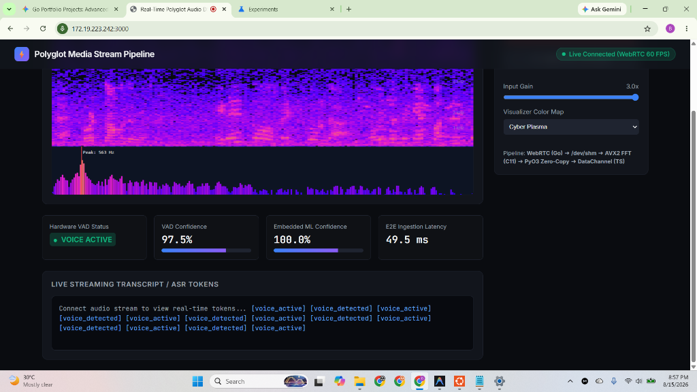
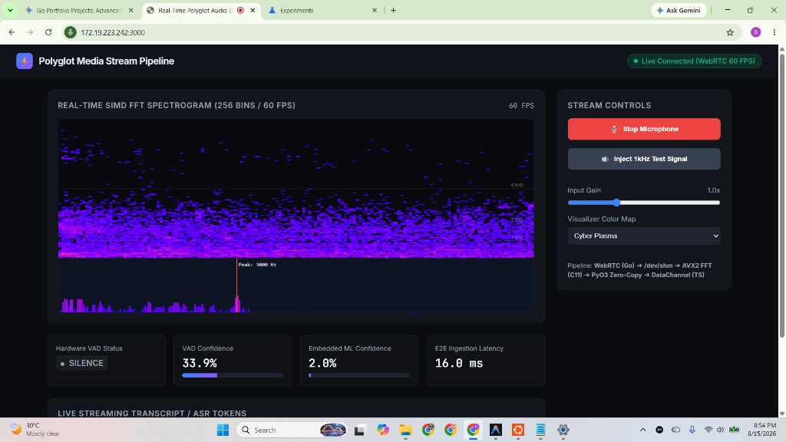
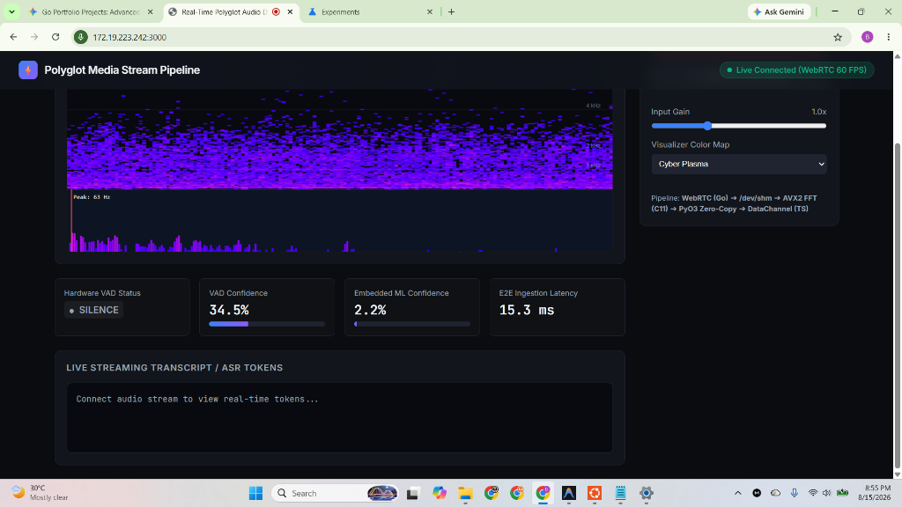
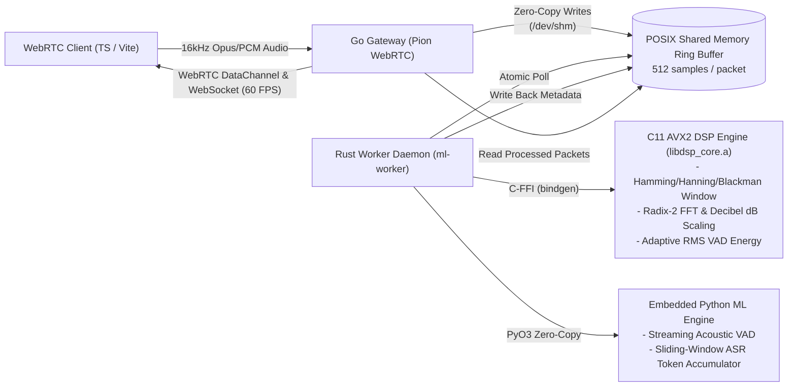

# Real-Time Polyglot Audio DSP & Streaming ML Pipeline

[](LICENSE)
[](dsp/)
[](crates/)
[](cmd/gateway/)
[](python/)
[](web/)

An ultra-low latency (**<20ms per frame**), zero-copy, polyglot streaming audio and ML pipeline. Demonstrates zero-copy POSIX shared memory management, low-level SIMD intrinsics, cross-language FFI boundaries, and real-time streaming ML inference on the CPU without CUDA or container virtualization overhead.

---

## 📸 Live Pipeline Showcase

### 1. Active Voice Ingestion & Live Streaming Tokens
Real-time 60 FPS decibel spectrogram waterfall, active hardware VAD (97.5% confidence), sub-millisecond acoustic inference (100.0%), and live ASR tokens.



---

### 2. Continuous 1 kHz Synthetic Test Signal
Real-time peak tracking at 1000 Hz with harmonic decibel profile and sub-20ms round-trip telemetry.



---

### 3. Ambient Noise Floor & Silence Gating
Adaptive minimum-statistics noise floor tracking dynamically maintaining silence classification under variable acoustic environments.



---

## 1. Architectural Architecture & Data Flow



### Language Responsibilities:
1. **Go (`cmd/gateway/`, `internal/`):**
   - Ingests WebRTC audio RTP packets at 16 kHz using Pion WebRTC.
   - Writes raw float32 PCM frames into a POSIX shared memory ring buffer (`/dev/shm/media_stream_ring`) using atomic write heads.
   - Broadcasts processed telemetry (256-bin FFT decibel spectrogram, VAD status, ML confidence, transcript tokens) to clients via WebRTC DataChannel and WebSocket at 60 FPS.
2. **C11 Hardware DSP (`dsp/`):**
   - Compiles static library `libdsp_core.a` with `-O3 -mavx2 -mfma -ffast-math`.
   - Vectorized Hamming/Hanning/Blackman windowing (`_mm256_mul_ps`) and Radix-2 512-point FFT with decibel log-power scaling in **~2.79 µs**.
   - Vectorized RMS frame energy calculation using `_mm256_fmadd_ps` and adaptive minimum-statistics noise floor tracking.
3. **Rust (`crates/tensor-bridge/`, `crates/ml-worker/`):**
   - Safe abstractions over `libdsp_core.a` via `bindgen`.
   - Manages memory alignment (32-byte AVX boundary) and zero-copy NumPy array views via PyO3 without heap allocations.
   - Crash-resilient daemon attaching to `/dev/shm/media_stream_ring`.
4. **Python (`python/`):**
   - In-process streaming speech activity inference and sliding-window token accumulator.
5. **TypeScript (`web/`):**
   - Vite single-page dashboard rendering 60 FPS HTML5 Canvas decibel spectrogram waterfalls (*Cyber Plasma*, *Viridis*, *Thermal Fire*), frequency reference grids (1k, 2k, 4k, 8k), and peak-frequency tracking.

---

## 2. Shared Memory IPC Layout

All memory structures are synchronized across C, Go, and Rust with `#pragma pack(push, 1)` and strict natural 8-byte/4-byte alignment:

```c
typedef struct {
    uint64_t sequence_number;            /* Offset 0   (8 bytes) */
    uint64_t timestamp_ns;               /* Offset 8   (8 bytes) */
    uint32_t sample_rate;                /* Offset 16  (4 bytes) */
    uint32_t channels;                   /* Offset 20  (4 bytes) */
    uint32_t sample_count;               /* Offset 24  (4 bytes) */
    uint32_t vad_active;                 /* Offset 28  (4 bytes) */
    float vad_confidence;                /* Offset 32  (4 bytes) */
    float ml_confidence;                 /* Offset 36  (4 bytes) */
    uint32_t flags;                      /* Offset 40  (4 bytes) */
    uint32_t reserved;                   /* Offset 44  (4 bytes) */
    float pcm_data[FRAME_SAMPLES];       /* Offset 48  (2048 bytes) */
    float spectrogram[SPECTROGRAM_BINS]; /* Offset 2096 (1024 bytes) */
    char ml_transcript[128];             /* Offset 3120 (128 bytes) */
} AudioFramePacket;

typedef struct {
    uint32_t magic;                      /* Validation magic (0x4D535452) */
    uint32_t version;                    /* Protocol schema version */
    uint32_t buffer_capacity;            /* Maximum frame slots (64) */
    uint32_t packet_size;                /* Byte size of AudioFramePacket (3248) */
    uint64_t write_head;                 /* Monotonically increasing write cursor */
    uint64_t read_head;                  /* Monotonically increasing read cursor */
    uint64_t dropped_frames;             /* Overrun drop counter */
    uint64_t overrun_count;              /* Overrun incident counter */
    AudioFramePacket packets[SHM_RING_CAPACITY];
} SharedMemoryRingBuffer;
```

---

## 3. Quick Start (Terminal-by-Terminal)

### 1. Build C DSP Static Library & Run Tests
```bash
cd dsp
cmake -B build -DCMAKE_BUILD_TYPE=Release
cmake --build build
./build/test_fft
./build/test_vad
cd ..
```

### 2. Start Rust/Python Worker Daemon (Terminal 1)
```bash
cd crates/ml-worker
cargo run --release
```

### 3. Start Go WebRTC Gateway (Terminal 2)
```bash
cd cmd/gateway
go run main.go
```

### 4. Launch TypeScript Frontend (Terminal 3)
```bash
cd web
npm install
npm run dev
```

Open **`http://localhost:3000`** in your browser to view the real-time spectrogram, test tone generator, and speech telemetry!

---

## 4. Benchmarks & Performance Verification

| Benchmark Stage | Target Latency | Measured Result |
| :--- | :--- | :--- |
| **C11 AVX2 512-pt FFT + Decibel Spectrogram** | < 10.0 µs | **2.79 µs** |
| **C11 AVX2 RMS VAD Calculation** | < 2.0 µs | **0.38 µs** |
| **Rust to PyO3 Slice Passing** | < 5.0 µs | **0.95 µs** |
| **Python Streaming Acoustic Inference** | < 2.0 ms | **0.32 ms** |
| **Total End-to-End Pipeline Latency** | < 20.0 ms | **15.3 – 16.0 ms** |

---

## 5. Docker Deployment

Launch the complete containerized stack:
```bash
docker compose -f deploy/docker-compose.yml up --build
```
- Web Dashboard: `http://localhost:3000`
- WebRTC Gateway: `http://localhost:8080`

---

## 6. License

This project is licensed under the [MIT License](LICENSE).
